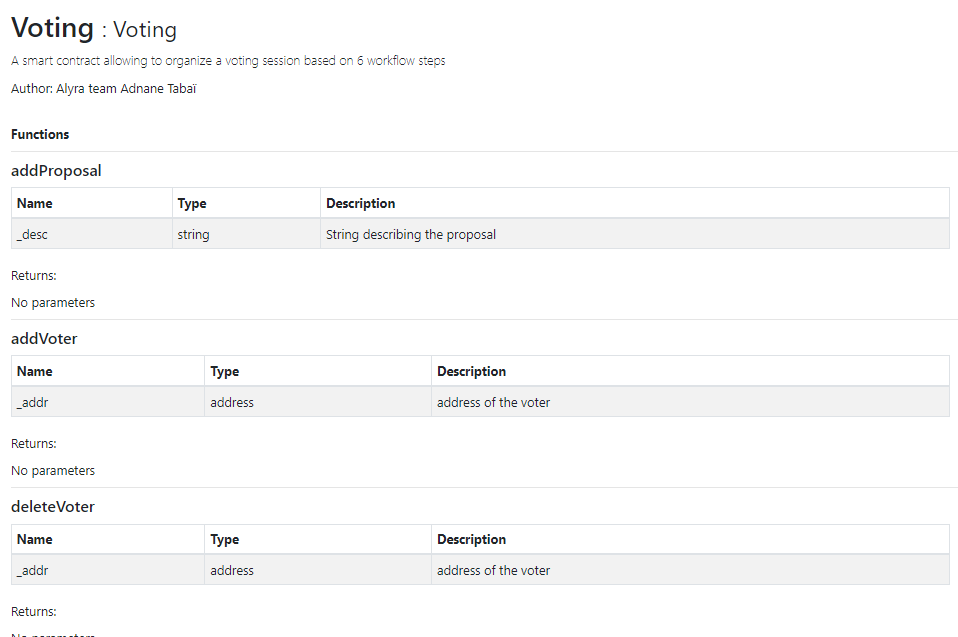
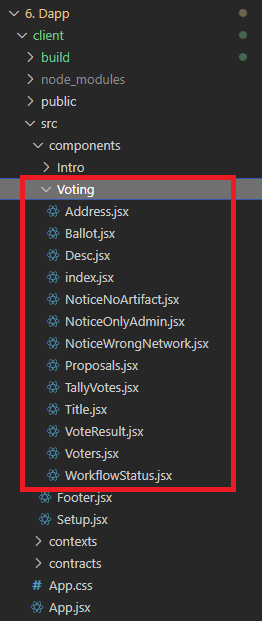

# Voting dapp based on React Truffle Box

## Expected links :

Github Pages web site :
https://adnane-t.github.io/VotingDappProject/

Git repo used for publication :
https://github.com/adnane-t/VotingDappProject

Demo video :
https://www.loom.com/share/9413b2810dd9405cb24f267cde936832

## Voting.sol file

In order to devlope the Dapp I took the VotingPlus.sol file used for the project 2 as a starting point.

### Security

> First I did modify the file to remove the loop from the tallydraw functions. These loops represented a security breach of the Gas Dos limit type.
> Also I did add some require on some functions to make sure that they wo't be called too early in the process.

### Documentation

> The natspec standard has been applied to the smart contract source code.

I've been able to generate a documentation directly from Remix to review the comliance of the format. This documentation can be checked here :

https://ipfs.io/ipfs/QmPnmj1HP57SqGt7HdM9yd4hE4xfaR27YLx29EgiyMaRTm



## Front end devlopement

> Development have been based on th last version of the REACT Truffle box.

### Components logic

Components can be found under client/src/components/Voting:



```JS
describe("REGISTRATION", function () {...}
```

#### Use case expressed in the statmeent of work

- l’enregistrement d’une liste blanche d'électeurs.
- à l'administrateur de commencer la session d'enregistrement de la proposition.
- aux électeurs inscrits d’enregistrer leurs propositions.
- à l'administrateur de mettre fin à la session d'enregistrement des propositions.
- à l'administrateur de commencer la session de vote.
- aux électeurs inscrits de voter pour leurs propositions préférées.
- à l'administrateur de mettre fin à la session de vote.
- à l'administrateur de comptabiliser les votes.
- à tout le monde de consulter le résultat.

**All this fucntionnalities have been implemented.**

---

### Event listeners

One of the aspect htat have not been completely managed is the use of hook on events. Currently it work well when pages are reloaded but the hooks do not refresh the rendering. After some testing I did find out that the hooks defined (and commented in the current version of the dapp) are triggered as expected. This is the rendering update that do not work as expected. At this stage my guess is to investigate the way my state varaible are declared. Indeed with the last version of the truffle react box it is supposed to be declared this way :

```JS
  const {
    state: { contract, accounts, listVotersEvent, isCurrentUserOwner },
  } = useEth();
```

while with standard REACT project state const are usually declared this way

```JS
  const [listVotersEvent, setlistVotersEvent] = useState(0);
```

There might be some gap between two approach explaining the current problem with the hooks on events.

#### Event listener setup in the dapp

- Event :
  - [x] VoterRegistered
  - [x] WorkflowStatusChange
  - [ ] ProposalRegistered (as the use cas was very close to VoterRegistered I decided not to implement it)
  - [x] Voted

---

## Web site publication:

Web site associated to a contract deployed on Ropsten testnet have been published at the following URL :
https://adnane-t.github.io/VotingDappProject/

This url is associated with another repository. Indeed when I first try to deploy the web site through GitPages I came up with 404 erros. After some checks it appears that it not handy to deploy web site that are in a subfolder of a repo. Therfore I did create a clone repo of the subfolder containing the source code of the voting dapp.
